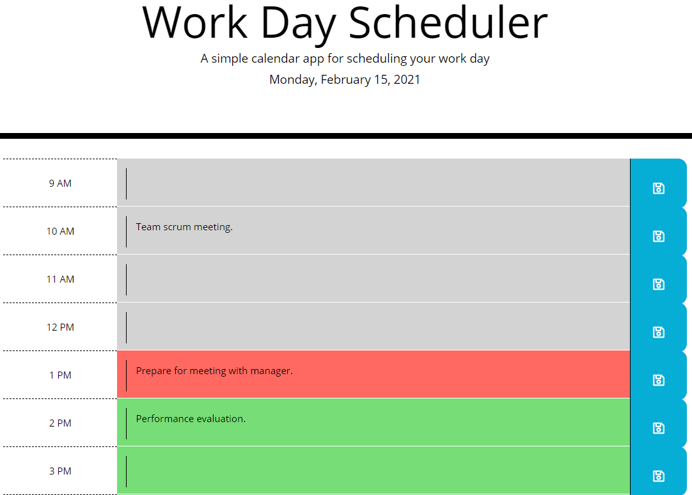

# DailyPlanner

## Description
The goal of this project was to create a simple calendar application that displayed the current date and allowed users to enter tasks and/or events for the hours between 9AM and 5PM. Hours of the day would be color-coded based on whether they were in the past, present, or future, and events recorded by the user were added to (and retrieved from) local storage.

## Acceptance Criteria

## Technologies Used
1. HTML
2. CSS
3. JavaScript
4. jQuery

## Questions?
Contact me at the following locations:

* Email: <a href="mailto:larrygjenkins@gmail.com">larrygjenkins@gmail.com</a>
* GitHub: <a href="https://github.com/larrygjenkins">github.com/larrygjenkins</a>
* LinkedIn: <a href="https://www.linkedin.com/in/l-jenkins/">linkedin.com/in/l-jenkins</a>

## Location
Use the following link to access the repository associated with this project: [Daily Planner Repository](https://github.com/larrygjenkins/DailyPlanner)

Use the following link to access the application: [Daily Planner](https://larrygjenkins.github.io/DailyPlanner/)

## Example Image
Following is an image of the application:

